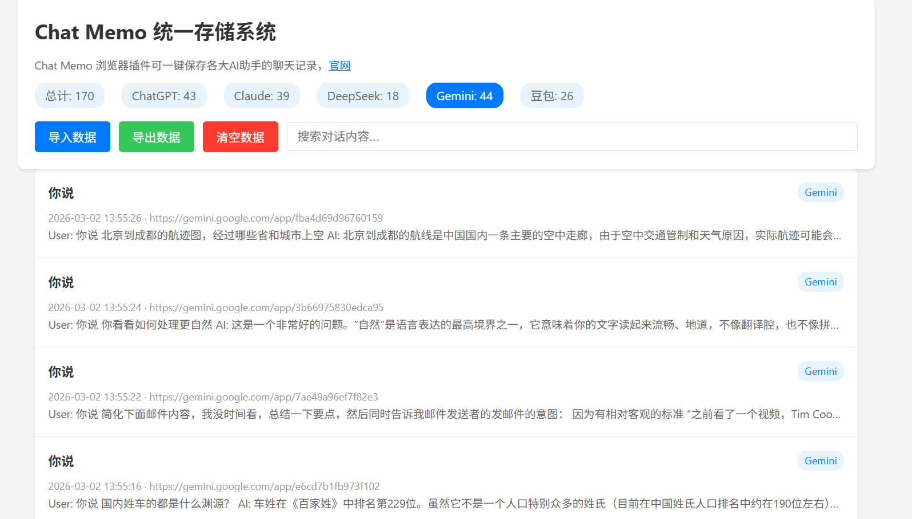

# Chat Memo 统一存储系统

将 **Chat Memo** 浏览器插件存储的各个 LLM Chat 提供商的对话记录保存在浏览器 `localStorage` 中，支持导出为单一文件以便持久化个人不同 LLM Chat的聊天记录。

[Chat Memo 官网](https://chatmemo.ai/)

**支持的LLM Chat**

- ChatGPT
- Gemini
- Claude
- DeepSeek
- 腾讯元宝
- 豆包
- Kimi

但这里有个比较大的问题：不同机器、不同浏览器（Edge/Chrome）的插件因为本地存储的问题，不能互通，即使是**相同账号**，所以就开发了这么一个极简的统一存储、合并、导出的本地 **Web** 应用。

## 界面预览




## 导出数据格式

采用插件的 **合并为一个文档** 导出模式，可以将所有保存的聊天记录一次性导出，格式如下

```text
# Chat Memo - All Conversations
Export Time: 2026-03-02 13:57:18
Total Conversations: 170

================================================================================

Title: 你说

北京到成都的航迹图，经过哪些省和城市上空
URL: https://gemini.google.com/app/fba4d69d96760159
Platform: Gemini
Created: 2026-03-02 13:55:26
Messages: 2

User: [2026-03-02 13:55:26]
你说

北京到成都的航迹图，经过哪些省和城市上空

AI: [2026-03-02 13:55:26]
北京到成都的航线是中国国内一条主要的空中走廊，由于空中交通管制和天气原因，实际航迹可能会略有不同，但通常会沿着一条大致的、避开特定空域的直线向西南方向飞行。

我将为您整理出这条航线通常会经过的省份和主要城市上空的大致路线信息。

我将生成一份Markdown文件来详细说明这条航线经过的省份和城市。
北京到成都航迹分析
12月17日 08:21
不使用 Canvas，再试一次

这条航线通常会从北京起飞，向西南方向穿越河北、山西和陕西等省，最终进入四川省，并降落在成都。途中会经过或靠近西安、太原等城市上空。

这份文件提供了从起点到终点沿途经过的省份和主要城市的详细概览。希望对您有所帮助！


================================================================================

Title: 你说

你看看如何处理更自然
URL: https://gemini.google.com/app/3b66975830edca95
Platform: Gemini
Created: 2026-03-02 13:55:24
Messages: 6

User: [2026-03-02 13:55:24]
你说

你看看如何处理更自然

AI: [2026-03-02 13:55:24]
这是一个非常好的问题。“自然”是语言表达的最高境界之一，它意味着你的文字读起来流畅、地道，不像翻译腔，也不像拼凑出来的。

由于你没有提供具体的文本，我将为你提供一套通用的“自然化”处理指南。这套方法适用于润色翻译稿、修改写作初稿，或者优化AI生成的内容。

要让文字更自然，我们需要从四个层面入手：语境与语气、词汇选择、句式结构、以及韵律感。

第一步：确认语境和对象 (Who & Where)

在动笔修改之前，先问自己两个问题：

这段话是写给谁看的？（朋友、老板、大众、还是学术专家？）

在什么场合发布？（微信聊天、正式邮件、技术文档、还是广告文案？）

不自然的表现： 在给朋友的微信里用“敬启者”；在技术文档里用“超酷的”。

处理方法：

定基调： 是严肃、活泼、专业，还是亲切？

代入感： 想象你就站在那个人面前对他说话，你会用什么词？

第二步：摆脱“翻译腔”和“机器味” (De-machinizing)

这是最常见的问题，特别是当文本是从外语翻译过来，或者由AI生成时。
```

格式说明：

1. 通过 `================================================================================` 分割多条
2. Title:  标识了这次对话（可以包含很多次与AI的对话）及相关的上下文
3. 单条导出是从 User:  开始的，然后形成 User:  -> AI: 对

## Chat Memo 统一存储系统功能

主要包含如下能力：

1. Web UI方式导入各个端，各浏览器独立导出的对话历史记录

2. 系统后端采用 `SQLite` 轻量数据库存储（包含标题，LLM Provider，对话记录，其他信息-如对话时间，扩展信息）

3. 系统根据 标题+ LLM Provider 进行字段去重，支持重复、多次导入

4. 支持再次全部导出为 **Chat Memo** 格式，以便其他 **Chat Memo** 生态的系统导入

5. Web 系统提供搜索框，以便全库检索自己的AI对话内容，快速重建知识

## 技术栈

技术采用极简模式，本地快速启动。

- SQLite 数据库
- Bun快捷开发，无需外部依赖
- 前后端统一开发语言
- 极少外部依赖

## 快速开始

### 环境要求

- **Bun**: >= 1.0.0 (推荐最新稳定版)
- **Node.js**: >= 18.0.0 (备用)
- **操作系统**: Windows 10+ / macOS 10.15+ / Linux

### 运行

```bash
# 安装依赖
bun install

# 启动服务器
bun run start
```

访问 http://localhost:3000

### 开发命令

```bash
# 启动开发服务器 (热重载)
bun --watch run start

# 直接运行
bun run start
```

## 打包

### Windows 打包 (x64)

1. 安装 Bun x64 版本: https://github.com/oven-sh/bun/releases

2. 安装 UPX 压缩工具 (可选):
   - 下载: https://github.com/upx/upx/releases
   - 解压后将 upx.exe 放到 PATH 或项目根目录

3. 打包命令:
```bash
bun build src/index.ts --compile --outfile chat-memo.exe
```

4. 压缩 (可选):
```bash
upx chat-memo.exe
```

5. 运行:
```bash
./chat-memo.exe
```

 Silicon 打包 (M1/M2### macOS Apple/M3)

1. 确保使用 ARM64 版本的 Bun:
```bash
# 检查架构
uname -m  # 应输出 arm64

# 如果是 x64，安装 ARM64 版本
# 下载: https://github.com/oven-sh/bun/releases
```

2. 打包命令:
```bash
bun build src/index.ts --compile --outfile chat-memo-mac
```

3. 添加执行权限:
```bash
chmod +x chat-memo-mac
```

4. 运行:
```bash
./chat-memo-mac
```

### 注意事项

- 打包后的可执行文件是独立的，无需安装 Bun 即可运行
- 数据库文件 `chat-memo.db` 会在首次运行时自动创建在工作目录
- Windows 下建议使用 `cmd` 或 `PowerShell` 执行
- macOS 下首次运行可能需要右键选择"打开"绕过 Gatekeeper，或使用:
```bash
xattr -rd com.apple.quarantine chat-memo-mac
```

